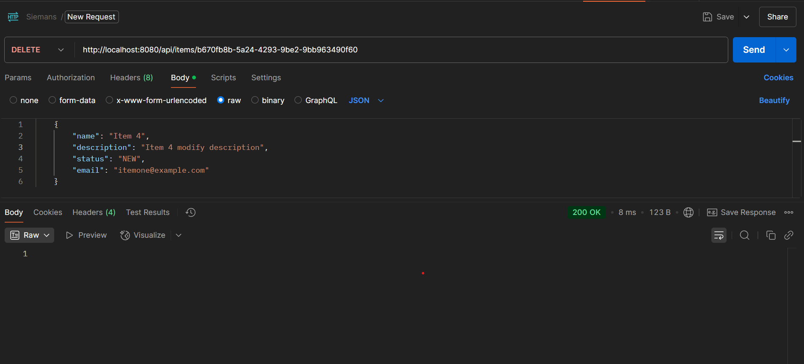

//full name: Drăgoi Ioan-Cosmin
## Hi there,
## I'm Cosmin and here is how I solve the internship problem 👋
---

##  API testing

Below are the Postman captures made while testing the API.

| Step | Operation | Screenshot |
|------|-----------|------------|
| 1 | List all items |  |
| 2 | Create an item (POST) |  |
| 3 | Retrieve that item (GET by ID) |  |
| 4 | Update an item (PUT) |  |
| 5 | Attempt to update a non-existent item |  |
| 6 | Trigger async processing of **all** items |  |
| 7 | Verify statuses after processing |  |
| 8 | Delete an item |  |
| 9 | Check list after deletion |  |

## Siemens Java Internship - Code Refactoring Project

This repository contains a Spring Boot application that implements a simple CRUD system with some asynchronous processing capabilities. The application was created by a development team in a hurry and while it implements all required features, the code quality needs significant improvement.

## Getting Started
- Clone this repository
- Import the project into your IDE as a Maven project (Java 17, might work with other Java versions as well)
- Study the existing code and identify issues
- Implement your refactoring changes
- Test thoroughly to ensure functionality is preserved

## Your Assignment
  The Project should have the following structure:

ⓘ
##  You will have to:
1. Fix all logical errors while maintaining the same functionality
2. Implement proper error handling and validation
3. Be well-documented with clear, concise comments
4. Write test functions with as much coverage as possible
5. Make sure that the Status Codes used in Controller are correct
6. Find a way to implement an email validation
7. Refactor the **processItemsAsync** function
    The **processItemsAsync** function is supposed to:
      1. Asynchronously process EVERY item (retrieve from database, update status, and save)
      2. Track which items were processed
      3. Return a list when all items have been processed
      4. Provide an accurate list of all successfully processed items
      HINT: You are free to modify the function and variables as much as you want :)

Copy the project and make the solution public on your personal GitHub.
Provide us the GitHub URL via email.
(Don't forget to make the repository PUBLIC 😁)
